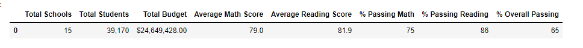
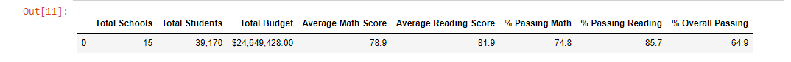
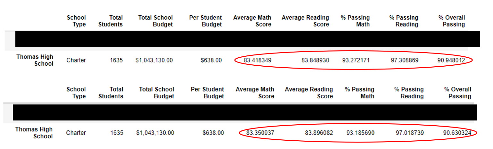

# School District Analysis

## Overview
We were hired to assist Maria who is a Chief Data Scientist for a city school district.  In order for the school board to make strategic budget allotments they requested that we aggregate standardized testing data from fifteen of the district's high schools. We then used this data to showcase perfomance trends based on grade level, student per capita, school size, and school type. 

The analysis covers 15 high schools totaling 39,170 students and two types of schools: Charter or District. After running the analysis, we were informed that one of the schools, Thomas High School, may have had some academically dishonest scores in their 9th grade testing scores. We then reworked the data in order to remove those grades from the analysis in order to see the affect, if any, on the overall analysis. 

## Resources
- Python Programming Language
- Anaconda for data processing
- Python Libraries: Pandas and NumPy for data analysis and manipulation and for DataFrame

## Results After Removing Thomas High 9th Grade Data
1. The district summary metrics changed only minimally overall. Average math score, passing math percentage, passing reading percentage, and the overall passing rate declined by less than or equal to .3% each. Meanwhile, the average reading score remained the same across the district.
- District Summary Before

- District Summary After

2. The school summary is not affected as Thomas high school remains ranked second in the county in both datasets. 
3. Below is an image of Thomas High School's metrics before and after removing the 9th Grade data. There was a miniscule decline in each of the metrics, with none having more than 1% difference.

4. Thomas High School remained in the same spending bin between $630-$644 per student and the metrics all remained the same for each spending bin.
5. The metrics all remained the same in both the size summary and school type DataFrames.

## Summary
- Overall, the removal of Thomas High School's data does not appear to have made a significant change. The school board should move forward with making strategic decisions on this data.
- It is most apparent that school size affects standardized testing scores more negatively as the size of the school moves into the large bin. It would be interesting to adjust the min/max numbers that were set for these bins.
- Charter school students perform  at a higher level than District students. We should add a per capita column to see what is spent on Charter students versus District students. 
- The metrics for both Thomas High School and the District summary where the only metrics to change and only declined by an insignificant amount. A statistical analysis could be run to prove this.  

